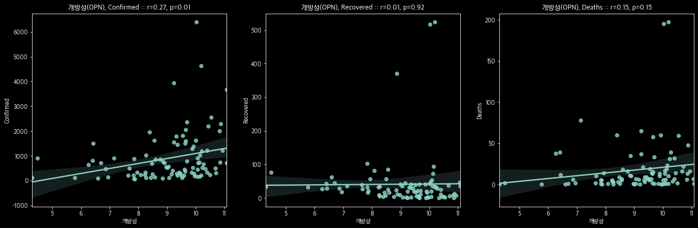
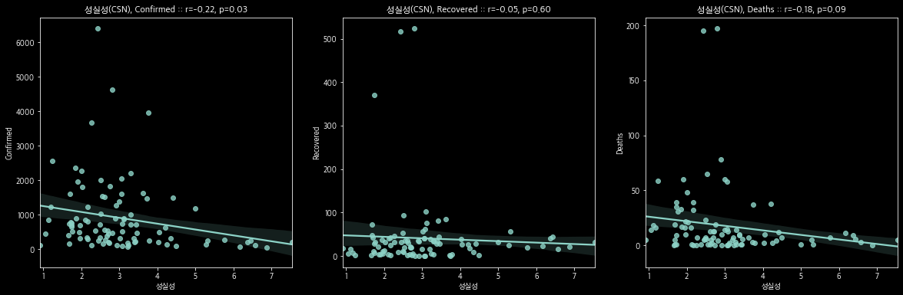

# Correlation of COVID-19 and the Big 5 Personality

Correlation of growth of confirmed cases and the Big 5 Personality Test

- Pearson correlation
- Spearman correlation

## Dependency

- Python 3
- pandas
- numpy
- matplotlib
- seaborn
- scipy

## Dataset

- Big Five Personality Test https://www.kaggle.com/tunguz/big-five-personality-test
- Novel Coronavirus 2019 time series data on cases https://github.com/datasets/covid-19

## Reference
- https://www.kaggle.com/bluewizard/covid-19-and-the-big-5-personality-test/
- https://openpsychometrics.org/tests/IPIP-BFFM/
- https://blog.naver.com/ygahon/60157517095
- https://docs.scipy.org/doc/scipy/reference/generated/scipy.stats.pearsonr.html
- https://docs.scipy.org/doc/scipy/reference/generated/scipy.stats.spearmanr.html
- https://support.minitab.com/ko-kr/minitab/18/help-and-how-to/statistics/basic-statistics/supporting-topics/correlation-and-covariance/a-comparison-of-the-pearson-and-spearman-correlation-methods/
